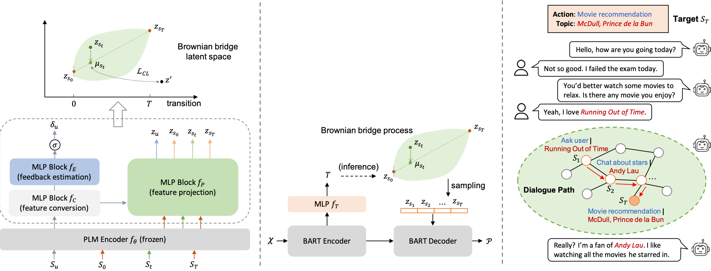

# Color4Dial
This repository contains code and data for the paper [Dialogue Planning via Brownian Bridge Stochastic Process for Goal-directed Proactive Dialogue]() (to appear) accepted as Findings of ACL'2023.


## Overview
Goal-directed dialogue systems aim to proactively reach a pre-determined target through multi-turn conversations. The key to achieving this task lies in planning dialogue paths that smoothly and coherently direct a dialogue towards the target. In this work, we propose a coherent dialogue planning approach called *COLOR* that uses a stochastic process to model the temporal dynamics of dialogue paths. We define a latent space that captures the coherence of goal-directed behavior using a Brownian bridge process, which allows us to adapt user feedback flexibly to the dialogue context. We generate dialogue paths based on pre-trained language models that are consistent with the latent plan. We finally employ these paths as natural language prompts to guide dialogue generation.

<p align="center">

</p>

## Requirements
To be released ...

## Quickstart
To be released ...


## Citation
If you use our code or data in your work, please kindly cite our work as:
```bibtex
@inproceedings{wang2023dialogue,
  title = {Dialogue Planning via Brownian Bridge Stochastic Process for Goal-directed Proactive Dialogue},
  author = {Wang, Jian and Lin Dongding, and Li, Wenjie},
  booktitle = {Findings of Annual Meeting of the Association for Computational Linguistics (ACL)},
  year = {2023}
}
```